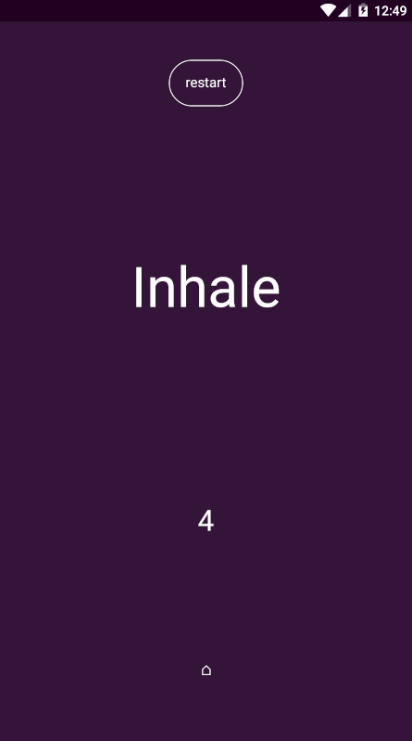

# breath478
an mobile app for practicing relaxing breath to reduce anxiety or help people get to sleep

The 4-7-8 breathing technique, also known as “relaxing breath,” involves breathing in for 4 seconds, holding the breath for 7 seconds, and exhaling for 8 seconds.
[Read more](https://www.medicalnewstoday.com/articles/324417)



# Download
[Version 1.0.1](https://github.com/ferrriii/breath-4-7-8/releases/download/v1.0.1/breath478.apk)

# Install
```
npm run install
```

# Build for Android
```
tns build android --release
--key-store-path ~/path/to/key.jks
--key-store-password my-very-secure-password
--key-store-alias Alias
--key-store-alias-password my-very-secure-password
```
# Publish
https://www.nativescript.org/blog/steps-to-publish-your-nativescript-app-to-the-app-stores

# License
Apache 2.0 License